# Daily Energy Telegram Mini-App

## Overview
The Daily Energy Telegram Mini-App is a user-friendly tool designed to help individuals track their daily activity, calorie intake, and energy levels. It offers an intuitive interface for setting personal details, monitoring progress, and receiving personalized feedback from an AI assistant.

## Functionality

### Registration
The initial setup process guides users through entering personal details to create a profile. Upon successful registration, the AI generates a personalized 7-day plan for food and activity based on the provided data.  

    
  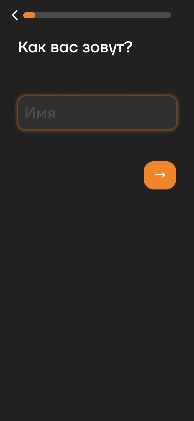  
  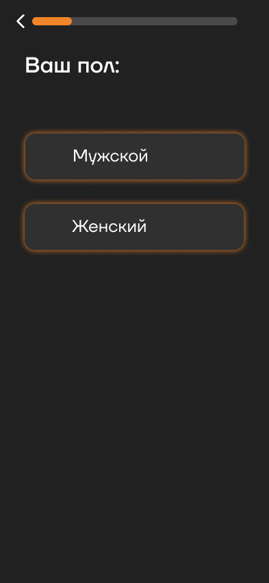  
  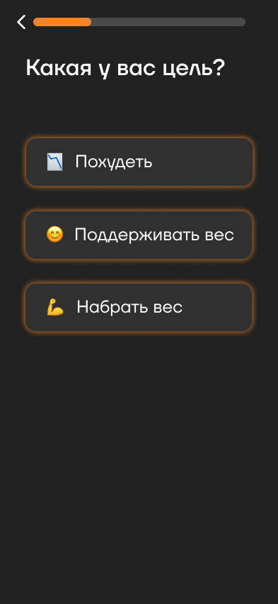  
  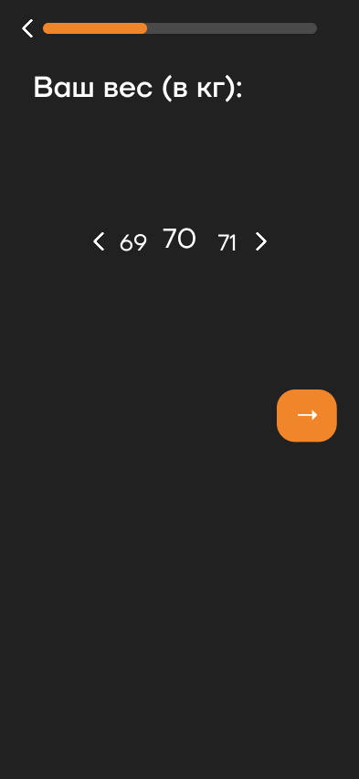  
  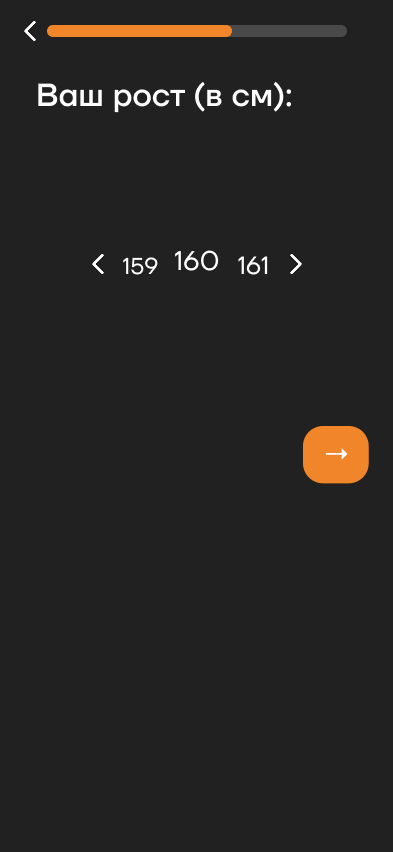  
  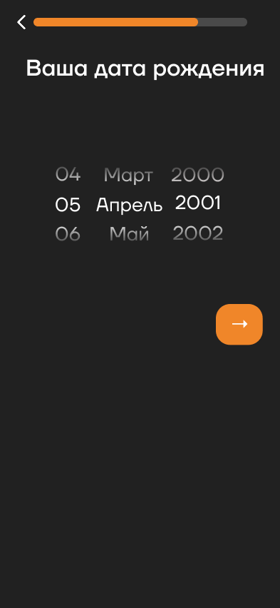  
  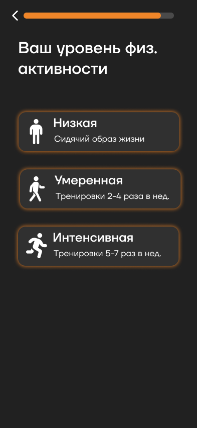  

### Interactive Chat with the AI Assistant Rafik (Mascot)
Users can engage in an interactive chat with Rafik, the AI mascot, for personalized advice and support.  

  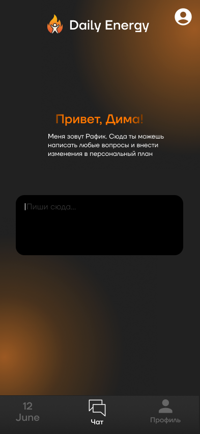  
  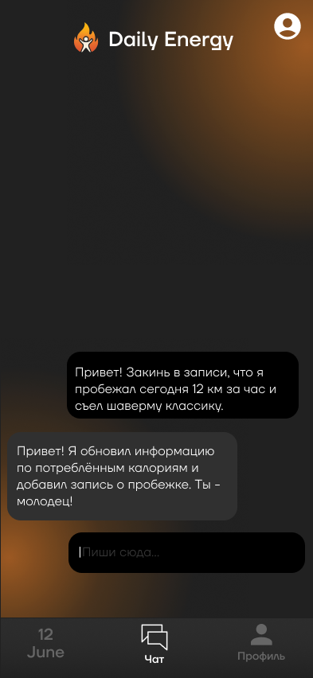  

### View and Add Today's Food and Activities
Track and log daily food intake and physical activities. When entering a food name, the AI calculates the average calorie content of a typical serving.  

  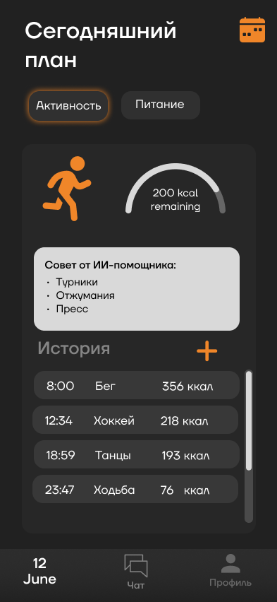  
  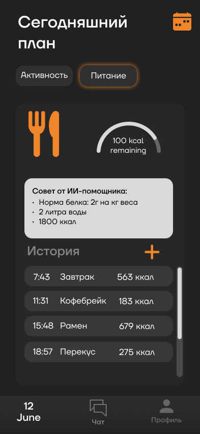  

  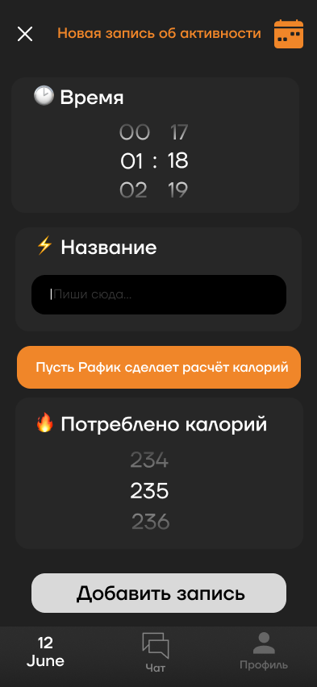  
  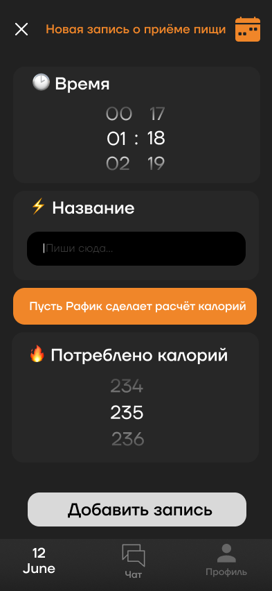  

### View History and Plan for Food and Activities
Review historical data and access the 7-day plan generated during registration for both food and activities.  

  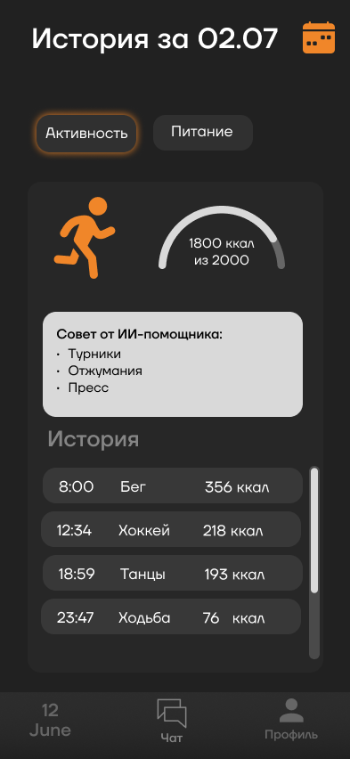  
  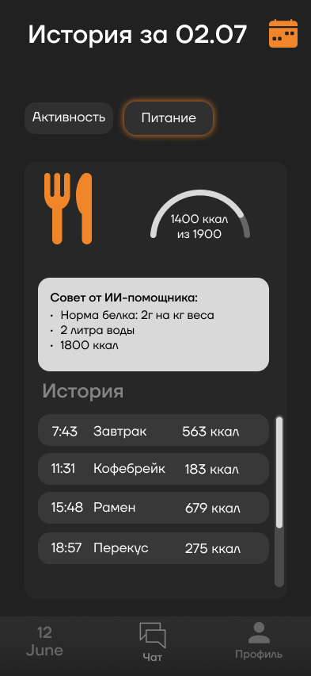

  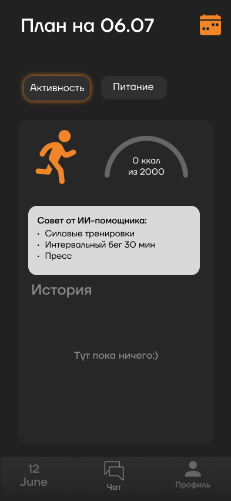  
  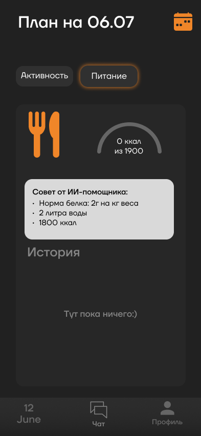  

### Calendar
Select a specific day to view its history or plan details.  

  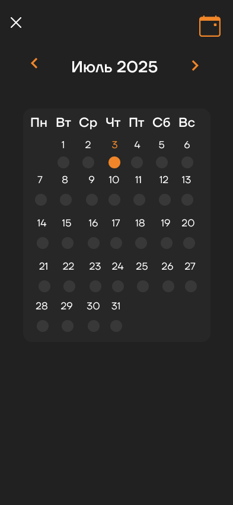  

### Profile
View personal progress dynamics and edit profile details as needed.  

  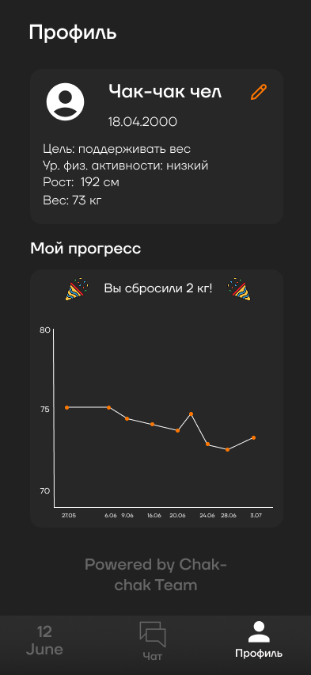  
  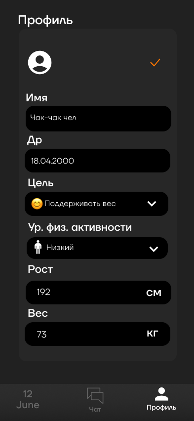  

## ER-diagram

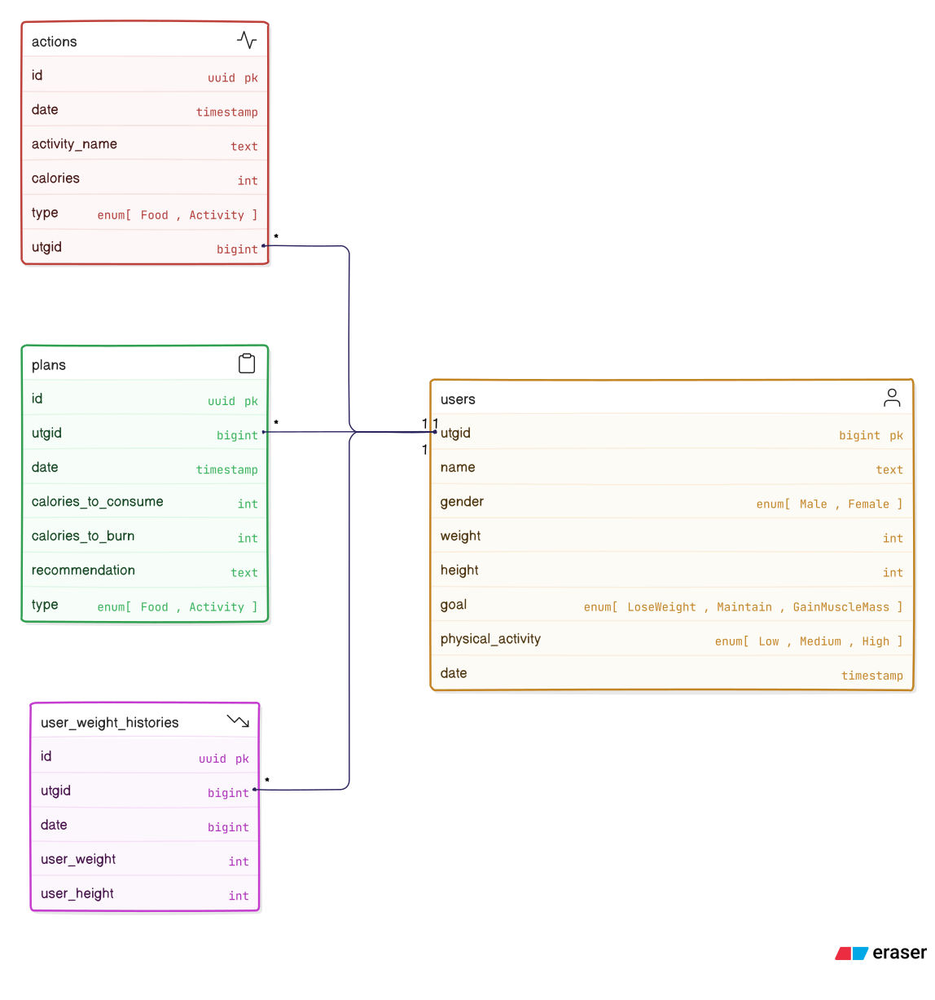

## Techologies

1. Golang
2. Typescript
3. gin
4. gorm
5. PostgreSQL
6. React
7. React Query
8. TailwindCSS
9. nginx
10. docker compose

As AI model we use openrouter/cypher-alpha:free.
